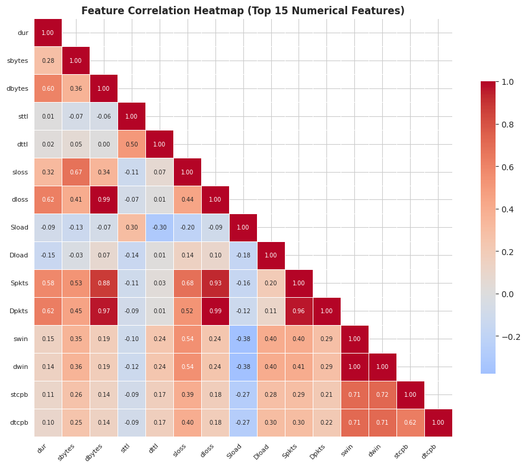
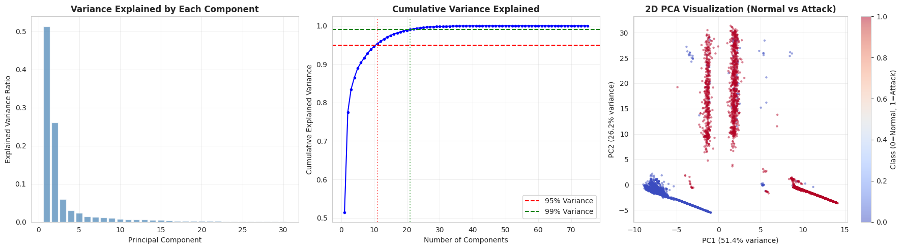
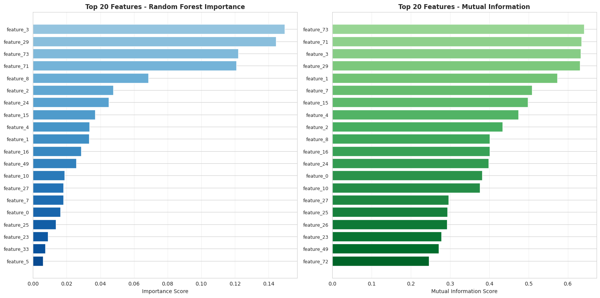
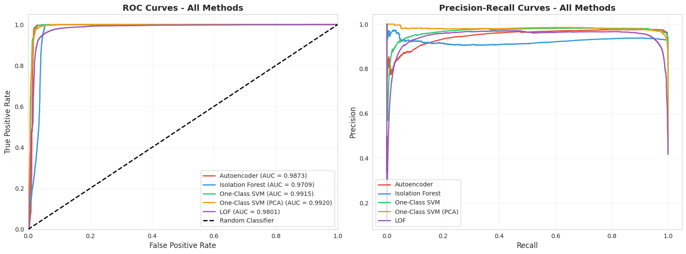
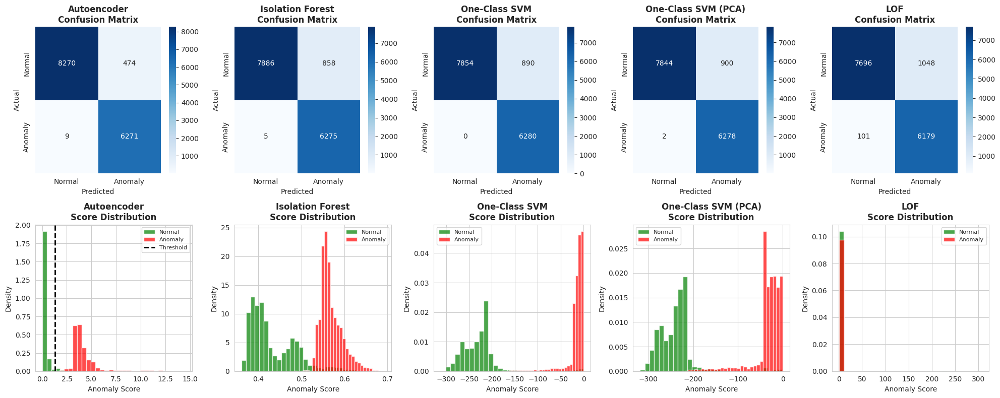
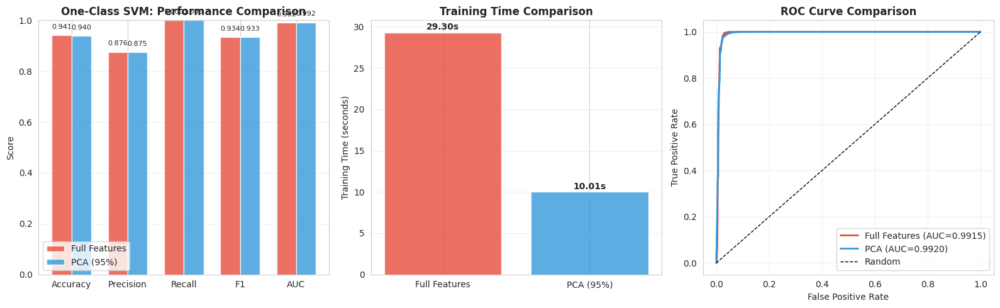
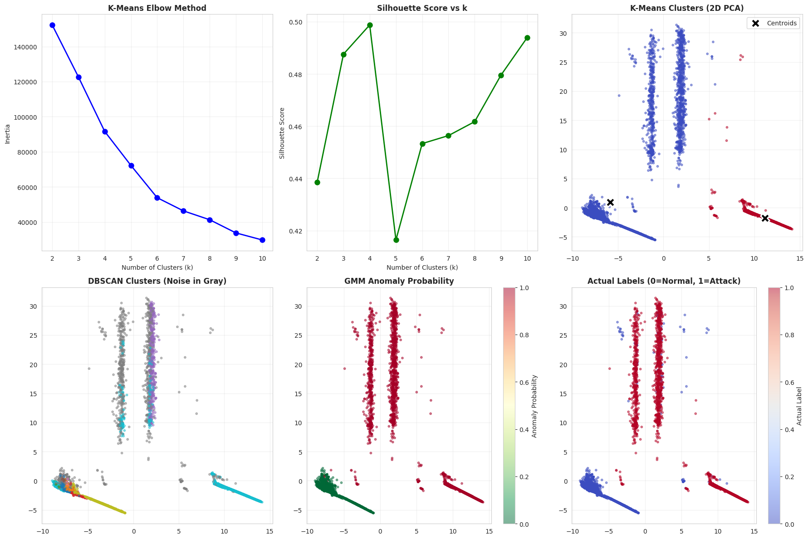
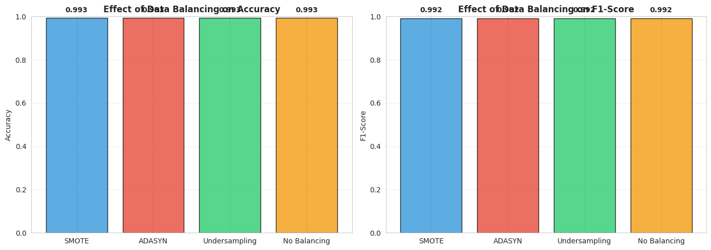
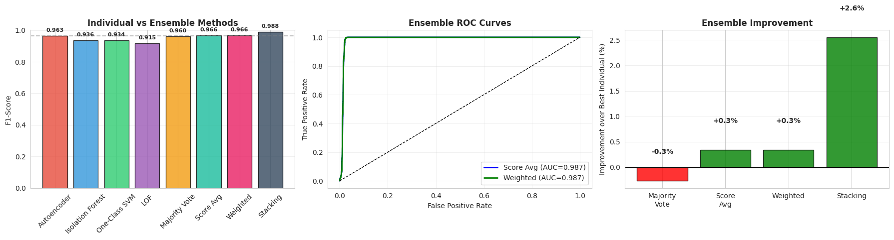
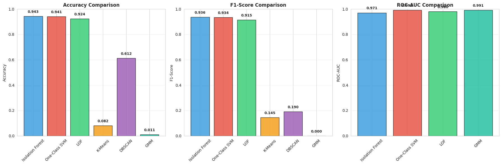

# CMPE255 Final Project Presentation

## Network Intrusion Detection Using Data Mining Techniques

---

## Slide 1: Title

### Content:

```
CMPE255 - Data Mining
Final Project

NETWORK INTRUSION DETECTION
Using Data Mining Techniques

Dataset: UNSW-NB15
```

### Script:

"Hello everyone. Today I'll be presenting my final project for CMPE255 Data Mining. The project focuses on network intrusion detection using the UNSW-NB15 dataset. The goal is to detect malicious network traffic—or attacks—using various data mining and machine learning techniques."

---

## Slide 2: Problem Statement

### Content:

```
THE PROBLEM

Traditional intrusion detection systems:
 Rely on known attack signatures
 Cannot detect zero-day attacks
 Require constant manual updates

Our Approach:
 Unsupervised anomaly detection
 Learn what "normal" looks like
 Flag anything that deviates
```

### Script:

"Traditional intrusion detection systems rely on signatures of known attacks. This means if a new attack emerges—what we call a zero-day attack—these systems will miss it completely. Our approach is different. We use unsupervised anomaly detection, which learns patterns of normal network traffic. Anything that doesn't fit this normal pattern gets flagged as potentially malicious. This way, we can detect attacks we've never seen before."

---

## Slide 3: Dataset Overview

### Content:

```
UNSW-NB15 DATASET

Total Records: 2.54 million
Sampled: 50,000

┌─────────────────────────────┐
│  Normal: 43,720 (87.4%)     │
│  Attack: 6,280  (12.6%)     │
└─────────────────────────────┘

49 Features including:
• Flow metrics (bytes, packets, duration)
• Protocol information (TCP, UDP, etc.)
• Connection states
• IP addresses and ports
```

### Script:

"The UNSW-NB15 dataset contains over 2.5 million network traffic records with 49 features each. For our experiments, we sampled 50,000 records. The dataset is imbalanced—about 87% normal traffic and 13% attacks. The attacks include various types like DoS, exploits, backdoors, and reconnaissance. The features capture flow-level information like bytes transferred, packet counts, connection duration, and protocol-specific details."

---

## Slide 4: Training Strategy

### Content:

```
KEY INSIGHT: Train on NORMAL data only

┌──────────────────────────────────────────┐
│            TRAINING DATA                 │
│         (Normal traffic only)            │
│              27,980 samples              │
└──────────────────────────────────────────┘
                    ↓
              Model learns
           "what normal looks like"
                    ↓
┌──────────────────────────────────────────┐
│              TEST DATA                   │
│       Normal (8,744) + Attack (6,280)    │
│              15,024 samples              │
└──────────────────────────────────────────┘
                    ↓
         Anomalies = Potential Attacks
```

### Script:

"Here's the key insight of our approach. We train our models exclusively on normal traffic—about 28,000 samples. The model learns the patterns and characteristics of legitimate network behavior. Then during testing, we present a mix of normal and attack traffic. Anything that doesn't match the learned normal patterns is flagged as anomalous—and these anomalies are our potential attacks. This mirrors real-world scenarios where we have plenty of normal traffic but attacks are rare and constantly evolving."

---

## Slide 5: Data Preprocessing

### Content:

```
PREPROCESSING PIPELINE

1. Missing Values → Median/Mode Imputation
   (69,408 values handled)

2. Outliers → Clipped to 1st-99th percentile
   (12,203 values clipped)

3. Categorical Encoding:
   ┌─────────────────────────────────────────────┐
   │ Low cardinality  → One-Hot Encoding         │
   │ (proto, state)      4 features → 32 columns │
   │                                             │
   │ High cardinality → Frequency Encoding       │
   │ (IP addresses)      4 features → 4 columns  │
   └─────────────────────────────────────────────┘

4. Numerical Features → Z-Score Normalization

Final: 75 features
```

### Script:

"Before modeling, we preprocessed the data. We handled missing values using median imputation for numerical features and mode for categorical. We clipped outliers to the 1st-99th percentile range rather than removing them—in network data, extreme values might be legitimate or indicative of attacks. For categorical encoding, we used a hybrid approach. Low-cardinality features like protocol type got one-hot encoded. But high-cardinality features like IP addresses—which have thousands of unique values—got frequency encoding to prevent dimensionality explosion. After preprocessing, we had 75 features."

---

## Slide 6: Correlation Analysis

### Content:



```
39 highly correlated pairs found (|r| > 0.8)

Examples:
• Stime ↔ Ltime: 1.000 (redundant!)
• tcprtt ↔ synack: 0.994
• dbytes ↔ Dpkts: 0.965
```

### Script:

"Our exploratory analysis revealed significant redundancy in the features. This heatmap shows correlations between numerical features. We found 39 pairs with correlation above 0.8. For example, start time and last time have perfect correlation—they provide identical information. TCP round-trip time metrics are also highly correlated. This redundancy suggests that dimensionality reduction like PCA could be effective, which we'll explore next."

---

## Slide 7: PCA Analysis

### Content:



```
DIMENSIONALITY REDUCTION

Original features:     75
95% variance retained: 11 components
99% variance retained: 21 components

First 2 components capture 77.5% of variance!
```

### Script:

"We applied Principal Component Analysis to understand the intrinsic dimensionality of our data. The results are striking—we can reduce from 75 features to just 11 components while retaining 95% of the information. The first two components alone capture 77.5% of variance, indicating strong underlying structure. This is particularly important for distance-based algorithms like SVM, where high dimensionality causes the 'curse of dimensionality'—all points become equidistant, making it hard to distinguish normal from anomalous."

---

## Slide 8: Feature Importance

### Content:



```
Two methods agree on top features:

Random Forest    Mutual Information
────────────     ──────────────────
feature_3        feature_73
feature_29       feature_71
feature_73       feature_3
feature_71       feature_29
```

### Script:

"We used two methods to identify important features: Random Forest importance and Mutual Information. Random Forest measures how much each feature contributes to classification decisions. Mutual Information measures statistical dependency, including non-linear relationships. Both methods agreed on the top features—feature_3, feature_29, feature_71, and feature_73—which validates their predictive importance."

---

## Slide 9: Anomaly Detection Methods

### Content:

```
5 UNSUPERVISED METHODS COMPARED

┌─────────────────┬───────────────┬─────────────────────────────┐
│ Method          │ Category      │ How it works                │
├─────────────────┼───────────────┼─────────────────────────────┤
│ Autoencoder     │ Deep Learning │ Reconstruction error        │
│ Isolation Forest│ Tree-based    │ Isolation depth             │
│ One-Class SVM   │ Kernel-based  │ Boundary around normal      │
│ OC-SVM + PCA    │ Kernel + PCA  │ Same, with dim. reduction   │
│ LOF             │ Density-based │ Local density comparison    │
└─────────────────┴───────────────┴─────────────────────────────┘
```

### Script:

"We compared five unsupervised anomaly detection methods. Autoencoder is a neural network that learns to reconstruct normal data—anomalies have high reconstruction error. Isolation Forest randomly partitions data; anomalies are easier to isolate, requiring fewer splits. One-Class SVM learns a boundary around normal data using an RBF kernel. We also tested SVM with PCA preprocessing to measure the impact of dimensionality reduction. Finally, Local Outlier Factor compares each point's local density with its neighbors—anomalies have lower density."

---

## Slide 10: Results - ROC Curves

### Content:



```
ROC-AUC Scores:
• One-Class SVM (PCA): 0.9920 ← Best AUC
• One-Class SVM:       0.9915
• Autoencoder:         0.9873
• LOF:                 0.9801
• Isolation Forest:    0.9709
```

### Script:

"Here are the ROC curves comparing all methods. ROC-AUC measures how well the model ranks anomalies higher than normal samples. One-Class SVM with PCA achieved the highest AUC at 99.2%, slightly better than regular SVM. This shows that dimensionality reduction actually helped. All methods performed well with AUC above 97%, indicating they can reliably distinguish attacks from normal traffic."

---

## Slide 11: Results - Performance Table

### Content:

```
COMPREHENSIVE RESULTS

Method              Accuracy  F1-Score  ROC-AUC  Time
─────────────────────────────────────────────────────
Autoencoder         96.79%    96.29%    98.73%   28.7s
Isolation Forest    94.26%    93.57%    97.09%   0.78s ← Fastest!
One-Class SVM       94.08%    93.38%    99.15%   29.3s
One-Class SVM (PCA) 94.00%    93.30%    99.20%   10.0s
LOF                 92.35%    91.49%    98.01%   6.74s

All methods: >98% Recall (critical for security!)
```

### Script:

"Looking at the full results, Autoencoder achieved the best accuracy and F1-score at nearly 97%. But Isolation Forest trained in under 1 second—37 times faster than Autoencoder—while still achieving 94% accuracy. Most importantly, all methods achieved over 98% recall. In security, recall is critical because a missed attack—a false negative—could lead to a breach. False alarms are annoying but manageable; missed attacks are dangerous."

---

## Slide 12: Confusion Matrices

### Content:



### Script:

"These confusion matrices show the actual predictions for each method. The top row shows confusion matrices—true labels versus predictions. You can see all methods have very few false negatives in the bottom-left corner, confirming our high recall. The bottom row shows score distributions—how the anomaly scores differ between normal and attack samples. Good separation between these distributions indicates the model can reliably distinguish the classes."

---

## Slide 13: PCA Impact Analysis

### Content:



```
ONE-CLASS SVM: Full Features vs PCA

                    Full (75)    PCA (16)    Change
────────────────────────────────────────────────────
Features            75           16          -79%
ROC-AUC             99.15%       99.20%      +0.05%
Training Time       29.3s        10.0s       2.9x faster!
F1-Score            93.38%       93.30%      -0.08%

 PCA removes noise, improves efficiency
 Slight AUC improvement despite 79% fewer features
```

### Script:

"This slide focuses on the PCA impact experiment. We compared One-Class SVM with all 75 features versus just 16 PCA components. The results are compelling: we reduced features by 79%, training time improved by nearly 3x, and ROC-AUC actually improved slightly. Why? The RBF kernel uses distance calculations, and in high dimensions, distances become meaningless. By removing redundant and noisy features, PCA made the distance calculations more meaningful. This demonstrates that more features isn't always better—smart preprocessing matters."

---

## Slide 14: Clustering Analysis

### Content:



```
CLUSTERING RESULTS

Method      Accuracy    F1-Score    Notes
──────────────────────────────────────────────
K-Means     8.15%       14.47%       Poor
DBSCAN      61.22%      19.04%      29 clusters
GMM         1.07%       0.00%       BUT AUC: 99.09%

Why clustering fails for anomaly detection:
• Attacks are diverse (not one cluster)
• Normal traffic dominates
• Anomalies defined by what they're NOT
```

### Script:

"We also tested clustering methods, but they performed poorly for direct classification. K-Means achieved only 8% accuracy. Why? Anomaly detection is fundamentally different from clustering. Attacks aren't a single cluster—they're diverse, including DoS, exploits, backdoors, and more. Clustering tries to group similar points, but anomalies are defined by being dissimilar to normal. However, GMM's probability scores achieved 99% AUC—the probability of not belonging to the normal cluster is actually a useful anomaly score."

---

## Slide 15: Data Balancing

### Content:



```
CLASS IMBALANCE: 87% Normal, 13% Attack

Technique       Distribution    Accuracy    F1-Score
────────────────────────────────────────────────────
Original        8,744 / 6,280   baseline    baseline
SMOTE           6,120 / 6,120   99.33%      99.21%
ADASYN          6,120 / 6,216   99.33%      99.21%
Undersampling   4,396 / 4,396   99.33%      99.21%

Note: Anomaly detection methods are inherently
robust to imbalance (train on normal only)
```

### Script:

"We explored data balancing techniques to address the class imbalance. SMOTE creates synthetic minority samples by interpolating between existing ones. ADASYN focuses on harder-to-learn regions. Undersampling removes majority class samples. Interestingly, all achieved identical 99.33% accuracy with a Random Forest classifier. The key insight is that our anomaly detection methods are inherently robust to imbalance because they only train on normal data—the imbalance in attack types doesn't affect training."

---

## Slide 16: Ensemble Methods

### Content:



```
COMBINING MULTIPLE MODELS

Ensemble Method     Accuracy   F1-Score   ROC-AUC
──────────────────────────────────────────────────
Majority Voting     96.54%     96.02%     -
Score Averaging     97.08%     96.63%     98.70%
Weighted Voting     97.08%     96.63%     98.71%
Stacking           ★99.02%    ★98.85%    ★99.59%

Stacking improvement over best single model:
+2.56% F1-Score, +0.39% ROC-AUC
```

### Script:

"Finally, we combined models using ensemble methods. Majority voting requires 3 of 4 models to agree. Score averaging combines anomaly scores. Weighted voting weights by individual AUC scores. But stacking performed best—it uses a meta-learner that learns the optimal combination. Stacking achieved 98.85% F1-score, a 2.56% improvement over the best single model. The meta-learner discovers complex patterns like 'when Autoencoder and SVM disagree, trust Autoencoder more.'"

---

## Slide 17: Model Comparison

### Content:



```
FINAL RANKINGS

Rank  Method               F1-Score   Best For
──────────────────────────────────────────────
1     Stacking Ensemble    98.85%     Maximum accuracy
2     Autoencoder          96.29%     Single model, interpretable
3     One-Class SVM (PCA)  93.30%     Best AUC, efficient
4     Isolation Forest     93.57%     Real-time (0.78s training!)
```

### Script:

"Here's the final comparison. Stacking ensemble is best for maximum accuracy when computation time isn't critical. Autoencoder is the best single model with good interpretability through reconstruction error analysis. One-Class SVM with PCA offers the best ROC-AUC with efficient training. And Isolation Forest is ideal for real-time applications—it trains in under a second while maintaining over 93% F1-score."

---

## Slide 18: Key Takeaways

### Content:

```
KEY TAKEAWAYS

1. PREPROCESSING MATTERS
   • Hybrid encoding prevented dimensionality explosion
   • PCA improved SVM by 2.9x speedup with better AUC

2. DEEP LEARNING EXCELS
   • Autoencoder: Best single-model performance (96.29% F1)
   • Learns complex non-linear patterns

3. ENSEMBLES WIN
   • Stacking: 98.85% F1, 99.59% AUC
   • +2.56% improvement over best single model

4. ALL METHODS: >98% RECALL
   • Critical for security applications
   • Missing attacks is costly
```

### Script:

"Let me summarize the key takeaways. First, preprocessing decisions matter significantly—our hybrid encoding and PCA choices directly impacted model performance. Second, deep learning with Autoencoder provided the best single-model performance by learning complex patterns. Third, ensemble methods, especially stacking, outperformed all individual models. And finally, all methods achieved high recall, which is critical in security where missing an attack could lead to a breach."

---

## Slide 19: Future Work

### Content:

```
FUTURE WORK

🚀 Real-time Deployment
   Isolation Forest for streaming detection

🔧 Feature Engineering
   Domain-specific features from importance analysis

🧠 Advanced Deep Learning
   • Variational Autoencoders (probabilistic)
   • LSTM for temporal patterns

⚡ Adaptive Thresholds
   Balance precision/recall based on risk tolerance
```

### Script:

"For future work, we could deploy Isolation Forest for real-time streaming detection given its fast training. We could engineer domain-specific features based on our importance analysis. We could explore variational autoencoders for probabilistic anomaly scores and LSTM networks for capturing temporal patterns in network flows. Finally, developing adaptive thresholds that adjust based on organizational risk tolerance would make the system more practical for deployment."

---

## Slide 20: Questions

### Content:

```
QUESTIONS?

Summary:
• Unsupervised anomaly detection for network intrusion
• 5 methods compared + ensemble approaches
• Best: Stacking ensemble (98.85% F1, 99.59% AUC)
• PCA: 2.9x speedup with improved performance

Thank you!
```

### Script:

"To summarize: we applied unsupervised anomaly detection to network intrusion detection, compared five different methods plus ensemble approaches. The stacking ensemble achieved the best results with nearly 99% F1-score and AUC. We also demonstrated that PCA preprocessing can significantly improve efficiency while maintaining or even improving accuracy. Thank you for your attention. I'm happy to take any questions."

---

## Appendix: Technical Details (if asked)

### Autoencoder Architecture

```
Input (75) → Dense(64) → Dropout → Dense(32) → Dropout
          → Encoding(32)
          → Dense(32) → Dropout → Dense(64) → Dropout → Output(75)

Loss: MSE (reconstruction error)
Threshold: 95th percentile of training reconstruction errors
```

### Hyperparameters

```
• Autoencoder: 30 epochs, batch_size=128, validation_split=0.2
• Isolation Forest: n_estimators=100, contamination=0.1
• One-Class SVM: kernel='rbf', nu=0.1, gamma='scale'
• LOF: n_neighbors=20, contamination=0.1, novelty=True
• PCA: n_components=0.95 (95% variance retained)
```
